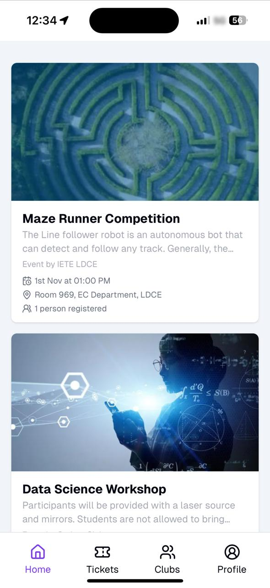
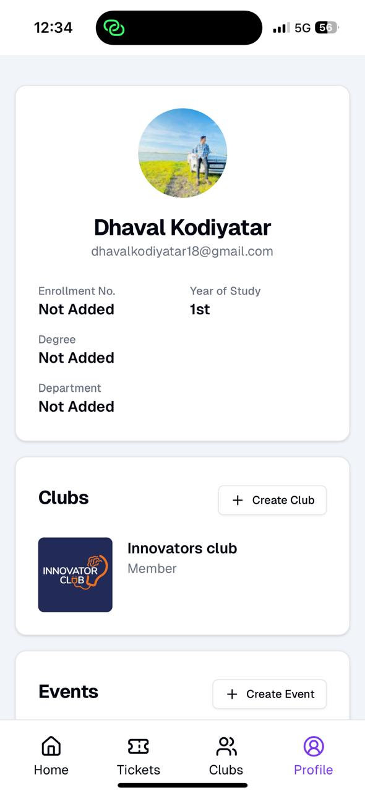
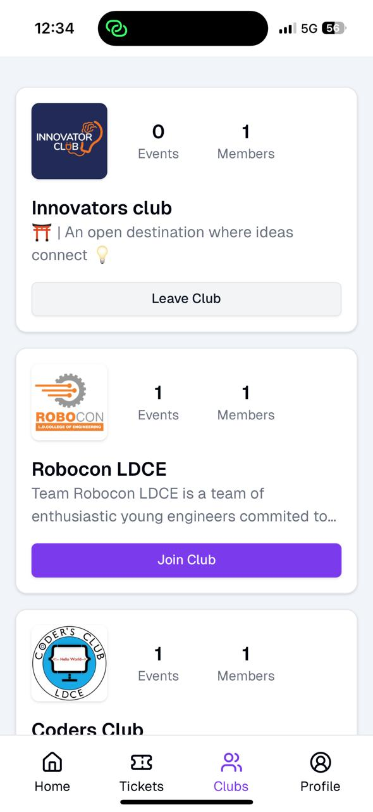
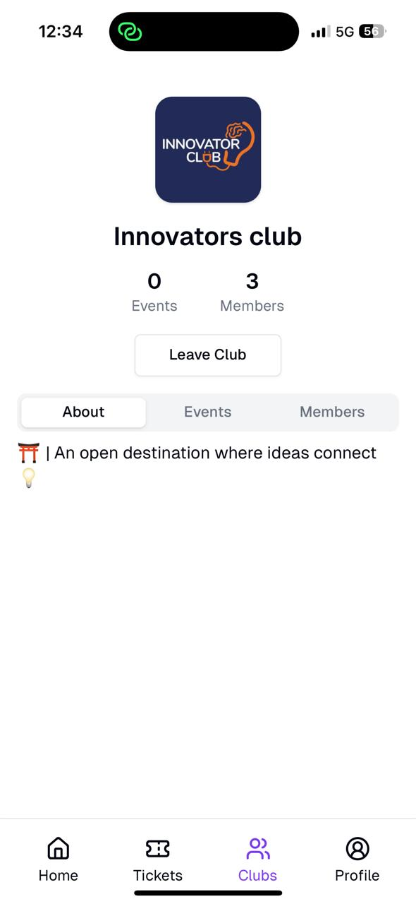
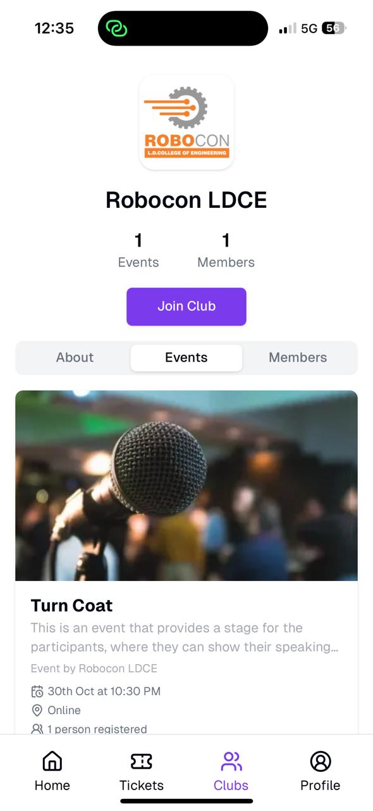
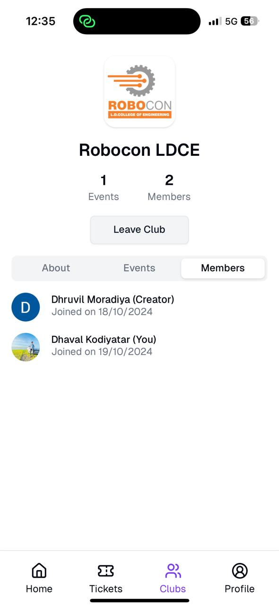
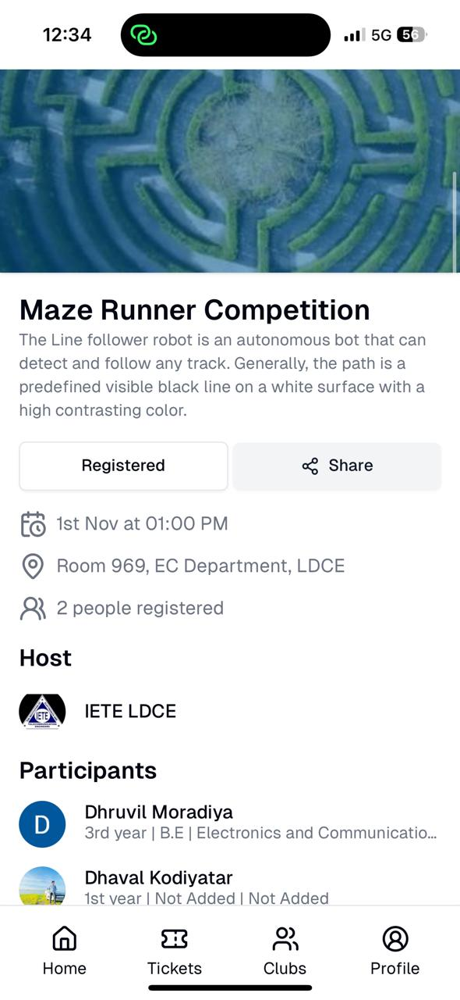

# College Connect

A Progressive Web App (PWA) to increase campus engagement and help students make meaningful connections at universities.

## Overview

College Connect is a platform designed to solve common challenges in university event management and student engagement:

- Centralized event discovery and registration
- Club/team management and membership
- Digital ticketing system with QR codes
- Real-time event updates and communication
- Streamlined onboarding for new students

## Tech Stack

This project uses the [T3 Stack](https://create.t3.gg/) with the following technologies:

- [Next.js](https://nextjs.org) - React framework for web applications
- [NextAuth.js](https://next-auth.js.org) - Authentication
- [Drizzle](https://orm.drizzle.team) - TypeScript ORM
- [tRPC](https://trpc.io) - End-to-end typesafe APIs
- [Tailwind CSS](https://tailwindcss.com) - Utility-first CSS framework
- [Uploadthing](https://uploadthing.com) - File uploads
- [Zod](https://zod.dev) - TypeScript-first schema validation
- [React Hook Form](https://react-hook-form.com) - Form handling
- [Lucide Icons](https://lucide.dev) - Icon set

## Features

- **Event Management**

  - Create and manage events
  - Register for events
  - QR code-based digital tickets
  - Event updates and notifications

- **Club Management**

  - Club discovery and joining
  - Member management
  - Club activity tracking
  - Event organization

- **User Features**
  - Student profiles
  - Event history
  - Ticket management
  - Real-time notifications

## Screenshots

<div align="center">
  <div style="display: grid; grid-template-columns: repeat(3, 1fr); gap: 20px;">
    
    
    
    
    
    
    
  </div>
</div>

## Getting Started

1. Clone the repository:

```bash
git clone https://github.com/mdhruvil/college-connect.git
```

2. Install dependencies:

```bash
bun install
```

3. Set up environment variables:

```bash
cp .env.example .env
```

4. Set up the database schema:

```bash
bun run db:push
```

5. Run the development server:

```bash
bun run dev
```

## Contributing

Contributions are welcome! Please feel free to submit a Pull Request.

## License

This project is licensed under the MIT License - see the LICENSE file for details.
